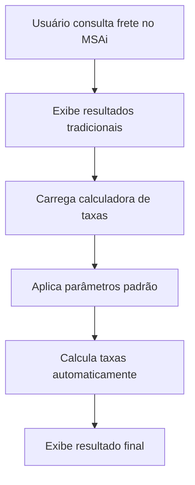
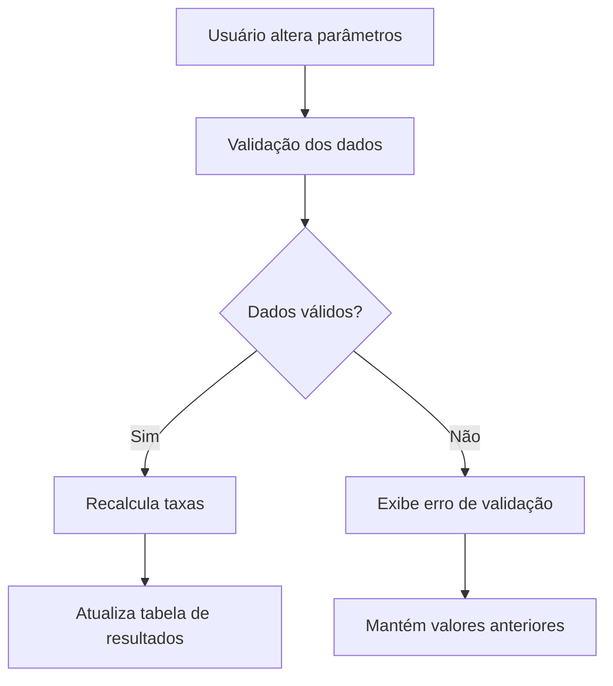

# MSAi Rodoviário - Calculadora de Taxas

## 📋 Visão Geral

O **MSAi Rodoviário** é uma ferramenta essencial para consulta de valores de frete com base no peso transportado. Esta funcionalidade adiciona uma **calculadora complementar** que estima o valor final do frete incluindo taxas obrigatórias do transporte rodoviário brasileiro.

## 🎯 Objetivo

Tornar o MSAi mais preciso e aderente à realidade de mercado, fornecendo aos usuários uma estimativa completa do custo total do frete, incluindo todas as taxas obrigatórias que impactam o valor final.

## ⚡ Problema Identificado

Atualmente, o MSAi Rodoviário apresenta **valores incompletos**, pois não considera taxas obrigatórias que fazem parte da realidade do transporte rodoviário no Brasil, como:

- ❌ Pedágio
- ❌ ICMS
- ❌ Ad Valorem
- ❌ Outras taxas regionais

## ✅ Solução Proposta

### Funcionalidades Implementadas

#### 🧮 Calculadora de Taxas Complementares
- **Localização**: Exibida abaixo dos resultados de frete existentes
- **Função**: Calcula e apresenta o valor estimado final com taxas aplicadas
- **Interface**: Integrada perfeitamente ao layout atual do MSAi

#### 📊 Taxas Contempladas

| Taxa | Base de Cálculo | Fonte dos Dados | Status |
|------|----------------|-----------------|--------|
| **ICMS** | Tabela pública origem × destino | Tabela estadual oficial | ✅ Implementado |
| **Ad Valorem** | Percentual sobre valor da carga | Tabela padrão de mercado | ✅ Implementado |
| **Pedágio** | Valor por quilômetro da rota | Estimativa baseada em distância | ✅ Implementado |
| **Outras taxas** | Conforme aplicabilidade | A definir | 🔄 Futuro |

## 🛠️ Especificações Técnicas

### Entrada de Dados

#### Parâmetros Obrigatórios
- **Valor da Carga (R$)**: Valor total da mercadoria transportada
- **Peso (kg)**: Peso total da carga
- **Distância (km)**: Quilometragem da rota origem-destino

#### Parâmetros Automáticos
- **Origem/Destino**: Capturados da consulta principal do MSAi
- **Tipo de Carga**: Herdado da consulta de frete base
- **Período de Vigência**: Sincronizado com as resoluções ativas

### Cálculos Implementados

#### 1. ICMS (Imposto sobre Circulação de Mercadorias e Serviços)
```
Valor ICMS = (Frete Base × Alíquota ICMS) / (1 - Alíquota ICMS)
```
- **Fonte**: Tabela pública estadual
- **Alíquotas**: Variáveis por estado (ex: SC → PR = 12%)
- **Atualização**: Automática via base de dados oficial

#### 2. Ad Valorem (Taxa de Seguro)
```
Valor Ad Valorem = Valor da Carga × Percentual Ad Valorem
```
- **Percentual Padrão**: 0,50% sobre o valor da carga
- **Base**: Tabela padrão de mercado
- **Variação**: Pode ser ajustada conforme tipo de carga

#### 3. Pedágio
```
Valor Pedágio = Distância (km) × Valor por km
```
- **Valor Médio**: R$ 0,18 por quilômetro
- **Base**: Estimativa baseada em rotas principais
- **Observação**: Valor aproximado para fins de estimativa

### Estrutura de Dados

#### Tabela de Saída
```sql
CREATE TABLE msai_calculadora_taxas (
    id INTEGER PRIMARY KEY,
    resolucao VARCHAR(50),
    periodo VARCHAR(20),
    origem_estado VARCHAR(2),
    origem_cidade VARCHAR(100),
    destino_estado VARCHAR(2),
    destino_cidade VARCHAR(100),
    frete_base DECIMAL(10,2),
    icms_aliquota DECIMAL(5,2),
    icms_valor DECIMAL(10,2),
    ad_valorem_percentual DECIMAL(5,2),
    ad_valorem_valor DECIMAL(10,2),
    pedagio_valor DECIMAL(10,2),
    total_taxas DECIMAL(10,2),
    valor_final DECIMAL(10,2),
    created_at TIMESTAMP DEFAULT CURRENT_TIMESTAMP
);
```

## 📱 Interface do Usuário

### Layout da Calculadora

#### Seção 1: Parâmetros de Entrada
- Campos editáveis para valor da carga, peso e distância
- Validação em tempo real dos valores inseridos
- Formatação automática de moeda e números

#### Seção 2: Detalhamento de Taxas
- Tabela com breakdown completo de cada taxa
- Colunas: Taxa, Base de Cálculo, Alíquota/Valor, Valor da Taxa
- Linha de totalização destacada

#### Seção 3: Resumo Final
- Comparação lado a lado: Frete Base vs. Valor Final
- Percentual de acréscimo das taxas
- Destaque visual para o valor total

### Elementos Visuais

#### Cores e Destaques
- **Verde (#34a853)**: Nova funcionalidade e valores finais
- **Amarelo (#ffc107)**: Campos editáveis e destaques
- **Azul (#1a73e8)**: Títulos e elementos de navegação
- **Cinza (#f8f9fa)**: Backgrounds e separadores

#### Responsividade
- Tabelas com scroll horizontal em dispositivos móveis
- Campos de entrada adaptáveis ao tamanho da tela
- Tooltips informativos para melhor UX

## 🔄 Fluxo de Funcionamento

### 1. Consulta Inicial


### 2. Interação do Usuário


## 📊 Fonte de Dados

### Tabela ICMS
- **Responsável**: Pablo (acesso já disponível)
- **Formato**: Matriz origem × destino com alíquotas por estado
- **Atualização**: Trimestral ou conforme legislação
- **Backup**: Tabela de contingência com valores médios

### Tabelas Ad Valorem
- **Fonte**: Padrões de mercado consolidados
- **Variação**: Por tipo de carga e valor segurado
- **Atualização**: Semestral ou conforme demanda

### Dados de Pedágio
- **Método**: Estimativa por quilometragem
- **Base**: Valor médio das principais concessionárias
- **Limitação**: Não considera praças específicas da rota

## 🚀 Benefícios Esperados

### Para os Usuários
- ✅ **Transparência total** nos custos de transporte
- ✅ **Estimativas mais precisas** para negociação
- ✅ **Economia de tempo** na consulta manual de taxas
- ✅ **Ferramenta completa** para tomada de decisão

### Para o Negócio
- ✅ **Diferencial competitivo** em relação a outras ferramentas
- ✅ **Maior aderência** à realidade do mercado
- ✅ **Redução de questionamentos** sobre valores "baixos"
- ✅ **Posicionamento como solução completa**

## 🔧 Instalação e Configuração

### Pré-requisitos
- Acesso à base de dados do MSAi Rodoviário
- Tabela ICMS atualizada (fornecida pelo Pablo)
- Configuração de API para cálculos em tempo real

### Passos de Implementação

#### 1. Configuração da Base de Dados
```sql
-- Criação das tabelas de apoio
CREATE TABLE icms_aliquotas (
    origem_estado VARCHAR(2),
    destino_estado VARCHAR(2),
    aliquota DECIMAL(5,2),
    vigencia_inicio DATE,
    vigencia_fim DATE
);

CREATE TABLE ad_valorem_tipos (
    tipo_carga VARCHAR(50),
    percentual DECIMAL(5,2),
    ativo BOOLEAN DEFAULT TRUE
);
```

#### 2. Integração com Frontend
```javascript
// Exemplo de integração
const calcularTaxas = (freteBase, valorCarga, peso, distancia) => {
    const icms = calcularICMS(freteBase, origemUF, destinoUF);
    const adValorem = calcularAdValorem(valorCarga);
    const pedagio = calcularPedagio(distancia);
    
    return {
        icms,
        adValorem,
        pedagio,
        total: icms + adValorem + pedagio,
        valorFinal: freteBase + icms + adValorem + pedagio
    };
};
```

#### 3. Configuração de APIs
- Endpoint para consulta de alíquotas ICMS
- Serviço de cálculo de taxas em tempo real
- Cache para otimização de performance

## 📈 Métricas e Monitoramento

### KPIs de Sucesso
- **Taxa de Utilização**: % de consultas que usam a calculadora
- **Precisão das Estimativas**: Comparação com valores reais de mercado
- **Satisfação do Usuário**: Feedback via pesquisas
- **Redução de Dúvidas**: Diminuição de tickets de suporte

### Monitoramento Técnico
- Performance dos cálculos (tempo de resposta < 500ms)
- Disponibilidade da funcionalidade (uptime > 99.5%)
- Precisão dos dados (validação mensal das tabelas)

## 🔮 Roadmap Futuro

### Fase 2 - Melhorias
- [ ] Cálculo de pedágio por rota específica (integração com APIs de concessionárias)
- [ ] Taxas regionais específicas (ex: Taxa de Resíduos Sólidos)
- [ ] Simulador de cenários (comparação entre diferentes rotas)
- [ ] Export dos resultados (PDF/Excel)

### Fase 3 - Inteligência
- [ ] Machine Learning para melhoria das estimativas
- [ ] Análise preditiva de variação de custos
- [ ] Alertas de mudanças significativas nas taxas
- [ ] Integração com ERPs para automatização

## 📞 Suporte e Contato

### Documentação Técnica
- **Wiki Interna**: Link para documentação detalhada
- **API Documentation**: Swagger/OpenAPI specs
- **Video Tutoriais**: Guias de uso para diferentes perfis

### Equipe Responsável
- **Product Owner**: [Nome]
- **Desenvolvedor Backend**: [Nome]
- **Desenvolvedor Frontend**: [Nome]
- **Analista de Dados**: Pablo (dados ICMS)

### Canais de Suporte
- **Slack**: #msai-calculadora-taxas
- **Email**: suporte-msai@empresa.com
- **Tickets**: Sistema interno de suporte

---

## 📄 Licença e Termos

Esta documentação é propriedade da empresa e destina-se exclusivamente ao uso interno para desenvolvimento e manutenção do MSAi Rodoviário.

**Última atualização**: Agosto 2025  
**Versão**: 1.0  
**Status**: Em desenvolvimento