# MSAi Rodoviário - Calculadora de Taxas

## 📋 Visão Geral

O **MSAi Rodoviário** é uma ferramenta essencial para consulta de valores de frete com base no peso transportado. Esta funcionalidade adiciona uma **calculadora complementar** que estima o valor final do frete incluindo taxas obrigatórias do transporte rodoviário.

## 🎯 Objetivo

Tornar o MSAi mais preciso e aderente à realidade de mercado, fornecendo aos usuários uma estimativa completa do custo total do frete, incluindo todas as taxas obrigatórias que impactam o valor final.

## ⚡ Problema Identificado

Atualmente, o MSAi Rodoviário apresenta **valores incompletos**, pois não considera taxas obrigatórias que fazem parte da realidade do transporte rodoviário no Brasil, como:

- ❌ Pedágio
- ❌ ICMS
- ❌ Ad Valorem
- ❌ Outras taxas regionais

## ✅ Solução Proposta

### Funcionalidades Implementadas

#### 🧮 Calculadora de Taxas Complementares

- **Localização**: Exibida abaixo dos resultados de frete existentes
- **Função**: Calcula e apresenta o valor estimado final com taxas aplicadas
- **Interface**: Integrada perfeitamente ao layout atual do MSAi

#### 📊 Taxas Contempladas

| Taxa             | Base de Cálculo                 | Fonte dos Dados                 |
| ---------------- | ------------------------------- | ------------------------------- |
| **ICMS**         | Tabela pública origem × destino | Tabela estadual oficial         |
| **Ad Valorem**   | Percentual sobre valor da carga | Tabela padrão de mercado        |
| **Pedágio**      | Valor por quilômetro da rota    | Estimativa baseada em distância |
| **Outras taxas** | Conforme aplicabilidade         | A definir                       |

## 🛠️ Especificações Técnicas

### Entrada de Dados

#### Parâmetros Obrigatórios

- **Valor da Carga (R$)**: Valor total da mercadoria transportada
- **Peso (kg)**: Peso total da carga
- **Distância (km)**: Quilometragem da rota origem-destino

#### Parâmetros Automáticos

- **Origem/Destino**: Capturados da consulta principal do MSAi
- **Tipo de Carga**: Herdado da consulta de frete base
- **Período de Vigência**: Sincronizado com as resoluções ativas

### Cálculos Implementados

#### 1. ICMS (Imposto sobre Circulação de Mercadorias e Serviços)

```
Valor ICMS = (Frete Base × Alíquota ICMS) / (1 - Alíquota ICMS)
```

- **Fonte**: Tabela pública estadual
- **Alíquotas**: Variáveis por estado (ex: SC → PR = 12%)
- **Atualização**: Automática via base de dados oficial

#### 2. Ad Valorem (Taxa de Seguro)

```
Valor Ad Valorem = Valor da Carga × Percentual Ad Valorem
```

- **Percentual Padrão**: 0,50% sobre o valor da carga
- **Base**: Tabela padrão de mercado
- **Variação**: Pode ser ajustada conforme tipo de carga

#### 3. Pedágio

```
Valor Pedágio = Distância (km) × Valor por km
```

- **Valor Médio**: R$ 0,18 por quilômetro
- **Base**: Estimativa baseada em rotas principais
- **Observação**: Valor aproximado para fins de estimativa

## Layout da Calculadora

#### Seção 1: Parâmetros de Entrada

- Campos editáveis para valor da carga, peso e distância
- Validação em tempo real dos valores inseridos
- Formatação automática de moeda e números

#### Seção 2: Detalhamento de Taxas

- Tabela com breakdown completo de cada taxa
- Colunas: Taxa, Base de Cálculo, Alíquota/Valor, Valor da Taxa
- Linha de totalização destacada

#### Seção 3: Resumo Final

- Comparação lado a lado: Frete Base vs. Valor Final
- Percentual de acréscimo das taxas
- Destaque visual para o valor total

### Elementos Visuais

#### Cores e Destaques

- **Verde (#34a853)**: Nova funcionalidade e valores finais
- **Amarelo (#ffc107)**: Campos editáveis e destaques
- **Azul (#1a73e8)**: Títulos e elementos de navegação
- **Cinza (#f8f9fa)**: Backgrounds e separadores

## 🔄 Fluxo de Funcionamento

### 1. Consulta Inicial

```mermaid
graph TD
    A[Usuário consulta frete no MSAi] --> B[Exibe resultados tradicionais]
    B --> C[Carrega calculadora de taxas]
    C --> D[Aplica parâmetros padrão]
    D --> E[Calcula taxas automaticamente]
    E --> F[Exibe resultado final]
```



### 2. Interação do Usuário

```mermaid
graph TD
    A[Usuário altera parâmetros] --> B[Validação dos dados]
    B --> C{Dados válidos?}
    C -->|Sim| D[Recalcula taxas]
    C -->|Não| E[Exibe erro de validação]
    D --> F[Atualiza tabela de resultados]
    E --> G[Mantém valores anteriores]
```



## 📊 Fonte de Dados

### Tabela ICMS

- **Responsável**: Pablo (acesso já disponível)
- **Formato**: Matriz origem × destino com alíquotas por estado
- **Atualização**: Trimestral ou conforme legislação
- **Backup**: Tabela de contingência com valores médios

### Tabelas Ad Valorem

- **Fonte**: Padrões de mercado consolidados
- **Variação**: Por tipo de carga e valor segurado
- **Atualização**: Semestral ou conforme demanda

### Dados de Pedágio

- **Método**: Estimativa por quilometragem
- **Base**: Valor médio das principais concessionárias
- **Limitação**: Não considera praças específicas da rota

## 🚀 Benefícios Esperados

### Para os Usuários

- ✅ **Transparência total** nos custos de transporte
- ✅ **Estimativas mais precisas** para negociação
- ✅ **Economia de tempo** na consulta manual de taxas
- ✅ **Ferramenta completa** para tomada de decisão

### Para o Negócio

- ✅ **Diferencial competitivo** em relação a outras ferramentas
- ✅ **Maior aderência** à realidade do mercado
- ✅ **Redução de questionamentos** sobre valores "baixos"
- ✅ **Posicionamento como solução completa**

## 🔧 Instalação e Configuração

### Pré-requisitos

- Acesso à base de dados do MSAi Rodoviário
- Tabela ICMS atualizada (fornecida pelo Pablo)
- Configuração de API para cálculos em tempo real

## 📈 Métricas e Monitoramento

### KPIs de Sucesso

- **Taxa de Utilização**: % de consultas que usam a calculadora
- **Precisão das Estimativas**: Comparação com valores reais de mercado
- **Satisfação do Usuário**: Feedback via pesquisas
- **Redução de Dúvidas**: Diminuição de tickets de suporte
